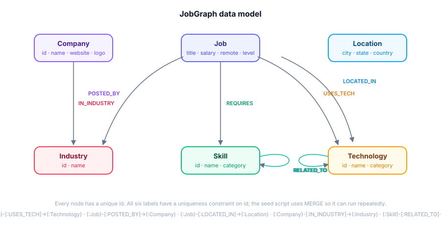

# JobGraph — Intelligent Job Explorer

> **Explore jobs through the connections between skills, technologies, companies, and opportunities.**

JobGraph is a full-stack, graph-powered job platform. Instead of a keyword search against a table of rows, every job lives as a **node in a graph** — connected to the skills it requires, the technologies it uses, the company that posted it, the location it's based in, and — through shared skills — to **other related jobs**.

The application is built for the **WEXA AI CognoDB assessment**: it uses **CognoDB** as its primary (and only) database, connected through the **official Neo4j JavaScript driver** (`neo4j-driver`), with every query written in **parameterized Cypher**.

---

## Table of contents

1. [Problem statement](#problem-statement)
2. [Why a graph database?](#why-a-graph-database)
3. [Features](#features)
4. [Architecture](#architecture)
5. [Graph data model](#graph-data-model)
6. [CognoDB setup](#cognodb-setup)
7. [Environment variables](#environment-variables)
8. [Installation & running](#installation--running)
9. [Seeding the database](#seeding-the-database)
10. [The key Cypher queries](#the-key-cypher-queries)
11. [API overview](#api-overview)
12. [Deployment](#deployment)
13. [Screenshots](#screenshots)
14. [Known limitations & future work](#known-limitations--future-work)
15. [Interview prep](#interview-prep)

---

## Problem statement

Job boards are great at answering *"which jobs contain the word React?"* — but terrible at answering the questions job seekers actually care about:

- *"Which other jobs exist that are similar to this one, and **why**?"*
- *"Which companies would hire me if I know TypeScript?"*
- *"How well does this job match **my** skill set, and can I see the math?"*
- *"What skills should I learn next to move toward a different role?"*

These are questions about **relationships**, not attributes. JobGraph models the domain as a graph and lets users walk those relationships directly — from a job to its skills, from a skill to every company hiring for it, and from one job to its neighbors through shared skills.

## Why a graph database?

Three queries in JobGraph are genuinely awkward in a relational database:

**1. Related jobs through shared skills (2 hops).**
```cypher
MATCH (j1:Job {id: $jobId})-[:REQUIRES]->(s:Skill)<-[:REQUIRES]-(j2:Job)
WHERE j1.id <> j2.id
RETURN j2, count(DISTINCT s) AS sharedSkills
ORDER BY sharedSkills DESC
```
In SQL this is a self-join over a `job_skills` join table, plus a group-by, plus a self-exclusion — and it gets uglier the more "hops" you add. In a graph it's a pattern match.

**2. Companies hiring for a skill (2 hops).**
```cypher
MATCH (j:Job)-[:REQUIRES]->(s:Skill {id: $skillId})
MATCH (j)-[:POSTED_BY]->(c:Company)
RETURN c, count(DISTINCT j) AS openJobs
```
"People who know skill X" → "jobs requiring X" → "companies posting those jobs". Two hop types in one traversal — exactly what a graph does naturally.

**3. Transparent skill-based job matching.** Match % = *your matched skills ÷ all required skills*. This needs two passes over the many-to-many `REQUIRES` edges:

```cypher
MATCH (j:Job)-[:REQUIRES]->(s:Skill)
WHERE s.id IN $skillIds
WITH j, count(DISTINCT s) AS matchingSkills
MATCH (j)-[:REQUIRES]->(required:Skill)
RETURN j, matchingSkills, count(DISTINCT required) AS totalSkills,
       round(100.0 * matchingSkills / totalSkills) AS matchPercentage
```

And beyond the queries: the **Graph Explorer page** renders the actual neighborhood of any job/skill/company (up to 2 hops) as a live force-directed graph. You aren't looking at a diagram of the data model — you're looking at the *data itself*, traversed in real time.

## Features

| Feature | What it does | Graph angle |
|---|---|---|
| **Dashboard** | Counts of every node label, most in-demand skills/technologies, recent jobs | Aggregations over `REQUIRES` / `USES_TECH` edges |
| **Job Explorer** | Full-text search + filters (skills, experience, employment, work mode, location) + sort + pagination | Filtering on required skills is a `MATCH` on an edge |
| **Job Details** | Full info, skills, technologies, company, **related jobs** | Related jobs = 2-hop shared-skill traversal |
| **Skill Explorer** | Skill pages with open jobs + **companies hiring for the skill** | 2-hop traversal through jobs |
| **Company Explorer** | Company profile, open jobs, aggregated skills/tooling/locations | Aggregation across a company's job subgraph |
| **Job Match** | Pick your skills → transparent match % with the breakdown shown | The relationship-heavy matching query above |
| **Graph Explorer** | Force-directed visualization of any node's 2-hop neighborhood, with legend & node details | Traversal results rendered as a graph |
| **Match badges** | Every job card shows your match % (skills stored in localStorage) | Client-side check against the skills the API returns |

## Architecture

```
┌─────────────────────┐       ┌──────────────────────┐       ┌──────────────────┐
│  Browser (React)    │  HTTP │  Express API (Node)  │ Bolt  │  CognoDB Cloud   │
│  Vite + Tailwind +  │──────▶│  routes → controllers│──────▶│  (Neo4j-compatible│
│  React Router       │       │  → services → queries│  cypher│   graph database)│
└─────────────────────┘       └──────────────────────┘       └──────────────────┘
   client/ (port 5173)           server/ (port 4000)            neo4j-driver
```

- In development, the Vite dev server **proxies `/api`** to Express (no CORS involved).
- In production, the client is served statically (Vercel) and points at the deployed API via `VITE_API_URL`.
- The server talks to CognoDB over the **Bolt protocol** using the official `neo4j-driver` package — CognoDB is Neo4j-wire-compatible, so no custom SDK is needed.
- Every API call that hits the database goes through **one function** (`runQuery` in `server/src/config/database.js`) which opens a session, runs the **parameterized** statement, and closes the session.

## Graph data model



### Nodes (6 labels, all with a uniqueness constraint on `id`)

| Label | Key properties |
|---|---|
| `Job` | `id`, `title`, `description`, `employmentType`, `experienceLevel`, `salaryMin`, `salaryMax`, `salaryCurrency`, `remoteType`, `postedAt` |
| `Company` | `id`, `name`, `logo`, `description`, `website` |
| `Skill` | `id`, `name`, `category` |
| `Technology` | `id`, `name`, `category` |
| `Location` | `id`, `city`, `state`, `country` |
| `Industry` | `id`, `name` |

### Relationships (7 typed types)

| Relationship | Meaning |
|---|---|
| `(:Job)-[:REQUIRES]->(:Skill)` | the job requires this skill |
| `(:Job)-[:USES_TECH]->(:Technology)` | the job uses this technology |
| `(:Job)-[:POSTED_BY]->(:Company)` | the job was posted by this company |
| `(:Job)-[:LOCATED_IN]->(:Location)` | the job is based in this location |
| `(:Company)-[:IN_INDUSTRY]->(:Industry)` | the company operates in this industry |
| `(:Skill)-[:RELATED_TO]->(:Skill)` | skills that commonly go together (both directions) |
| `(:Technology)-[:RELATED_TO]->(:Technology)` | technologies that commonly go together (both directions) |

**Why these relationships?** Each one answers a real product question. `REQUIRES` is the backbone: it powers related jobs, companies-hiring-for-a-skill, and job matching. `RELATED_TO` powers "what should I learn next?" paths (e.g. JavaScript → TypeScript → React). The two-hop chains (`Job → Skill → Company`, `Job → Skill → Job`) are the app's signature features.

## CognoDB setup

1. Go to [cognodb.com](https://cognodb.com), sign up, and create a free **c0 instance** (no credit card).
2. Choose a region and note the **connection string** — it looks like `bolt+s://db-xxxx.databases.cognodb.cloud`.
3. Copy the auto-generated **password** (shown exactly once).
4. The default database username is `cognodb`.

CognoDB speaks the Bolt protocol (v5.x) and Cypher, so the official Neo4j driver works as-is — that's the whole point of the assessment.

## Environment variables

Copy the example files and fill in real values. **Never commit `.env`** (it's gitignored).

**`server/.env`** (required):
```bash
COGNODB_URI=bolt+s://db-xxxx.databases.cognodb.cloud
COGNODB_USERNAME=cognodb
COGNODB_PASSWORD=your-generated-password
PORT=4000
CLIENT_ORIGIN=*
```

**`client/.env`** (optional): only needed when the client talks to a *deployed* API:
```bash
VITE_API_URL=https://your-api.onrender.com/api
```

Credentials are read exclusively from environment variables (`server/src/config/env.js`). The database module refuses to connect — and the API returns a friendly `503` — when they're missing, so the frontend never crashes on a misconfigured backend.

## Installation & running

Requires Node.js 18+ (developed on Node 24).

```bash
# 1. Install everything (root + server + client)
npm run setup

# 2. Add your CognoDB credentials (see above)
cp server/.env.example server/.env   # then edit with real values

# 3. Load the seed data into CognoDB
npm run seed

# 4. Run both servers
npm run dev
```

- Frontend: http://localhost:5173
- API: http://localhost:4000 (health check: http://localhost:4000/api/health)

You can also run them separately: `npm run server` and `npm run client`.

**No credentials yet?** The app still runs — every page shows a friendly "CognoDB is offline" state with a retry button, so you can develop the UI before the database exists.

## Seeding the database

```
npm run seed          # MERGE-based: safe to re-run, never duplicates
npm run seed:reset    # DETACH DELETE everything first, then re-seed
```

`server/scripts/seed.js`:

1. Verifies the connection (fails fast with a helpful message otherwise).
2. Creates six uniqueness constraints (`CREATE CONSTRAINT ... REQUIRE n.id IS UNIQUE`).
3. Upserts ~13 industries, 20 locations, 18 companies, 46 skills, 31 technologies with `MERGE`.
4. Creates `RELATED_TO` edges (both directions), `IN_INDUSTRY` edges.
5. Generates **80+ realistic jobs** deterministically (seeded PRNG) — with titles, descriptions, salaries scaled by experience level, remote/hybrid/onsite mix, and 5–6 skills + 3–4 technologies each.
6. Creates `REQUIRES`, `USES_TECH`, `POSTED_BY`, `LOCATED_IN` edges.
7. Prints a summary, including a live **2-hop example** (companies hiring for JavaScript).

The dataset is deliberately dense: skills like JavaScript/React/SQL appear in dozens of jobs, so graph queries return rich results and related-jobs ranking is meaningful.

## The key Cypher queries

All queries live in `server/src/queries/` and are **100% parameterized** — user input only ever arrives via `$params`, never string concatenation. The query *shape* may be assembled from fixed, allow-listed fragments (see `buildJobsQuery` in `jobQueries.js`), but values are always bound.

### Jobs requiring a skill (1 hop)
```cypher
MATCH (j:Job)-[:REQUIRES]->(s:Skill {id: $id})
OPTIONAL MATCH (j)-[:POSTED_BY]->(c:Company)
RETURN j, c ORDER BY j.postedAt DESC
```

### Companies hiring for a skill (2 hops)
```cypher
MATCH (j:Job)-[:REQUIRES]->(s:Skill {id: $id})
MATCH (j)-[:POSTED_BY]->(c:Company)
WITH c, count(DISTINCT j) AS openJobs
RETURN c, openJobs ORDER BY openJobs DESC
```

### Related jobs through shared skills (2 hops)
```cypher
MATCH (j1:Job {id: $jobId})-[:REQUIRES]->(s:Skill)<-[:REQUIRES]-(j2:Job)
WHERE j1.id <> j2.id
WITH j2, count(DISTINCT s) AS sharedSkills, collect(DISTINCT s.name) AS sharedSkillNames
RETURN j2, sharedSkills, sharedSkillNames
ORDER BY sharedSkills DESC LIMIT $limit
```

### Job matching by user skills (relationship-heavy)
```cypher
MATCH (j:Job)-[:REQUIRES]->(s:Skill)
WHERE s.id IN $skillIds
WITH j, count(DISTINCT s) AS matchingSkills, collect(DISTINCT s.name) AS matchedSkillNames
MATCH (j)-[:REQUIRES]->(required:Skill)
WITH j, matchingSkills, matchedSkillNames,
     count(DISTINCT required) AS totalSkills,
     collect(DISTINCT required.name) AS requiredSkills
RETURN j, matchingSkills, matchedSkillNames, totalSkills, requiredSkills,
       round(100.0 * matchingSkills / totalSkills) AS matchPercentage
ORDER BY matchPercentage DESC LIMIT $limit
```

### Dashboard stats (one pass over labels)
```cypher
MATCH (n)
WHERE n:Job OR n:Company OR n:Skill OR n:Technology OR n:Location OR n:Industry
RETURN labels(n)[0] AS type, count(*) AS count
```

## API overview

| Method | Endpoint | Description |
|---|---|---|
| GET | `/api/health` | Server + database status (200 when connected, 503 otherwise) |
| GET | `/api/stats` | Dashboard aggregates (counts, popular skills/technologies, recent jobs) |
| GET | `/api/jobs` | Job listing with `q`, `skills[]`, `experienceLevel`, `employmentType`, `remoteType`, `location`, `sort`, `limit`, `offset` |
| GET | `/api/jobs/:id` | Full job with skills, technologies, company, industry, location |
| GET | `/api/jobs/:id/related` | Related jobs via shared skills (2-hop), ranked |
| GET | `/api/jobs/:id/connections` | Graph neighborhood for the Graph Explorer |
| POST | `/api/jobs/match` | Body `{ "skillIds": [...] }` → jobs with transparent match % |
| GET | `/api/skills` | All skills with open-job counts |
| GET | `/api/skills/:id` | Skill + related skills + job/company counts |
| GET | `/api/skills/:id/jobs` | Jobs requiring the skill |
| GET | `/api/skills/:id/companies` | Companies hiring for the skill (2-hop) |
| GET | `/api/skills/:id/connections` | Graph neighborhood |
| GET | `/api/companies` | All companies with open-job counts + industry |
| GET | `/api/companies/:id` | Company profile |
| GET | `/api/companies/:id/jobs` | Jobs + aggregated skills/technologies/locations |
| GET | `/api/companies/:id/connections` | Graph neighborhood |
| GET | `/api/locations` | Locations with job counts (used by filters) |

All ids are validated with a strict allow-listed pattern; filters are whitelisted; match bodies are size-limited and de-duplicated. Errors return `{ message, code }` — internal details are logged server-side but never leaked to the browser.

## Deployment

### Backend → Render (free)
1. Push this repo to GitHub.
2. In [Render](https://render.com), choose **New → Blueprint** and connect the repo (a `render.yaml` is included).
3. Set the secret env vars: `COGNODB_URI`, `COGNODB_USERNAME`, `COGNODB_PASSWORD`, and `CLIENT_ORIGIN` (your Vercel URL). Render sets `PORT` automatically.

### Frontend → Vercel (free)
1. In [Vercel](https://vercel.com), import the repo, set **Root Directory** to `client`, framework = Vite (a `vercel.json` with SPA rewrites is included).
2. Add the env var `VITE_API_URL=https://<your-render-app>.onrender.com/api` and redeploy.

### Final check
`GET <render-url>/api/health` should return `{ "status": "ok" }`, and the deployed site should list jobs.

## Screenshots

> Screenshots go in this section (and can live in a `screenshots/` folder). Recommended: dashboard, job explorer with filters, job details with related jobs, skill details with companies-hiring, job match results, and the Graph Explorer.

## Known limitations & future work

- **No real auth** — user skills live in localStorage, which is fine for a demo but not multi-device.
- **No vector/embedding search** — CognoDB is a graph engine; fuzzy text search is simple `CONTAINS`. A hybrid graph + vector search is a natural next step (GraphRAG).
- **Static dataset** — the seed is realistic but generated; no live job feeds.
- **Graph Explorer** uses a purpose-built lightweight force simulation (no external graph library) — great for ~100 nodes, not for 10k.
- **No pagination on every list** (skills/companies are small enough to return fully).

## Interview prep

Be ready to explain:

- **Why a graph database here?** The product is about relationships (job↔skill↔company↔job). The three showcase queries (related jobs, companies-for-a-skill, matching) traverse edges directly; in SQL they'd be multi-join aggregations that get exponentially worse as you add hops. The Graph Explorer makes the case visually.
- **How the driver connects to CognoDB?** `neo4j.driver(uri, neo4j.auth.basic(user, password))` over Bolt; CognoDB is Neo4j-wire-compatible so no custom SDK. `verifyConnectivity()` checks the connection at boot and via `/api/health`.
- **How parameterization prevents injection?** `session.run(cypher, params)` binds `$name` placeholders server-side; user input never becomes part of the query text. The only dynamic Cypher is assembled from fixed allow-listed fragments with all values in `params`.
- **How a request flows?** React page → axios (`/api` proxy in dev, `VITE_API_URL` in prod) → Express route → middleware validation → controller → service → `runQuery` → session on the CognoDB driver → records mapped to JSON via `toPlain()` → back through the same path. Timeouts and 5xx are normalized into friendly messages by the axios interceptor.
- **Why MERGE for the seed?** Uniqueness constraints on `id` + `MERGE` = idempotent re-runs; `--reset` offers a clean slate when you want to change the dataset.

---

Built with React + Vite + Tailwind, Express, and CognoDB via the official Neo4j JavaScript driver. 💜
